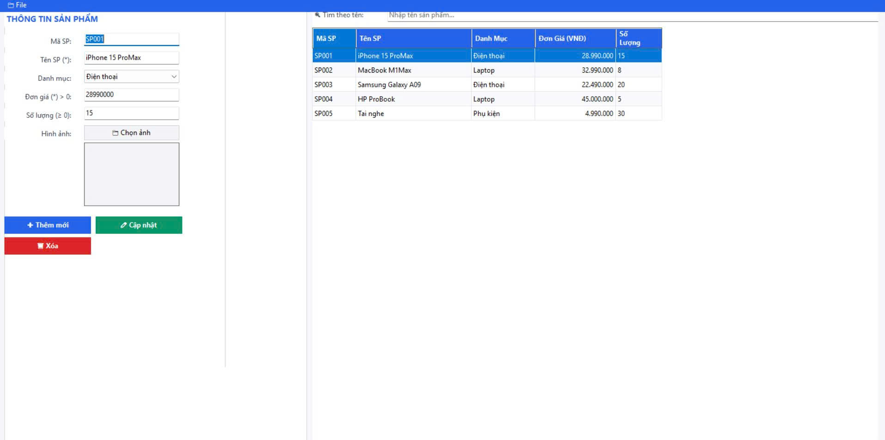
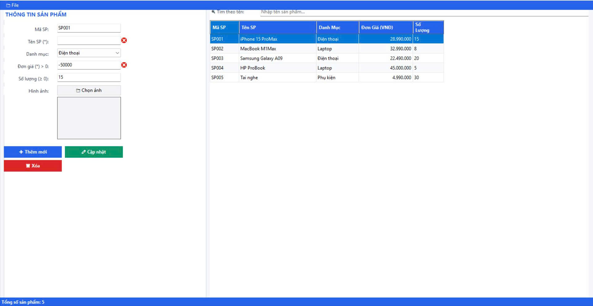
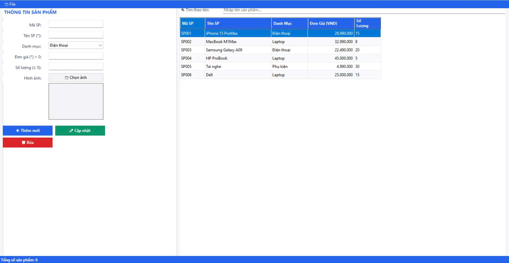
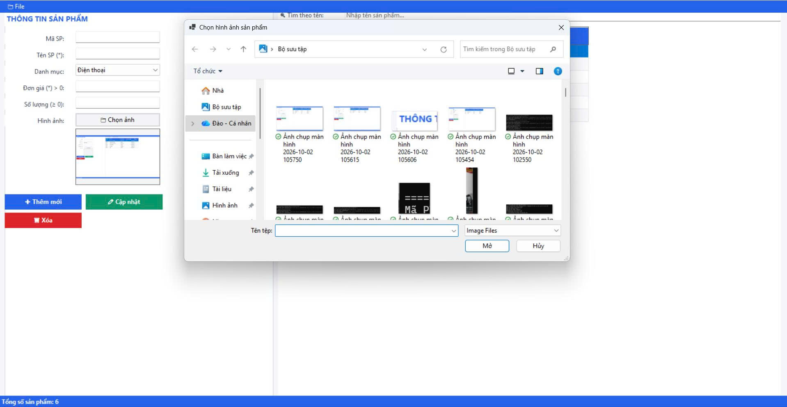
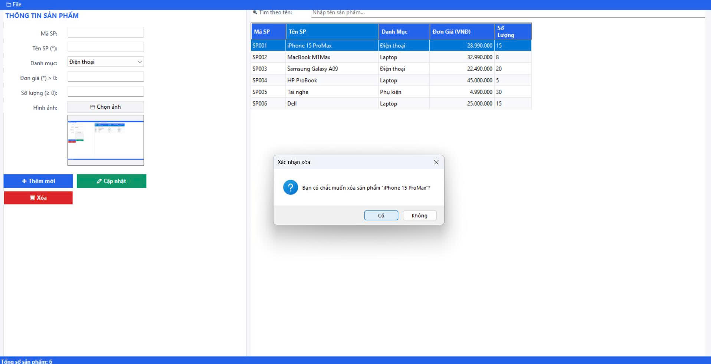

# Bài 3 – TechMart Product Manager (WinForms)

**Sinh viên:** Trần Đức Hùng Anh – **Mã SV:** 24810310616

## Cách mở bằng Visual Studio

1. Mở **Visual Studio 2022**
2. **File → Open → Project/Solution**
3. Chọn file `TechMartManager\TechMartManager.csproj`
4. Nhấn **F5** hoặc **▶ Start** để chạy

## Ảnh chụp màn hình

> *(Chụp màn hình sau khi chạy và đính kèm vào đây)*

